<div align="center">

# 🏥 Predicting Insurance Enrollment

**A production-grade machine learning pipeline predicting employee opt-ins for voluntary insurance products.**

[](https://python.org)
[](https://scikit-learn.org)
[](https://mlflow.org)
[](https://fastapi.tiangolo.com)
[](#testing)

<br/>

*From raw demographic and employment data to a deployed production REST API.*

</div>

---

## 📋 Table of Contents

- [Problem Statement](#-problem-statement)
- [Project Architecture](#-project-architecture)
- [Overall Workflow](#-overall-workflow)
- [ML Pipeline Workflow](#-ml-pipeline-workflow)
- [Quick Start](#-quick-start)
- [Exploratory Data Analysis](#-exploratory-data-analysis)
- [Model Training & Evaluation Results](#-model-training--evaluation-results)
- [API Usage](#-api-usage)
- [Experiment Tracking](#-experiment-tracking)
- [Testing](#-testing)
- [Key Design Decisions](#-key-design-decisions)
- [Future Improvements](#-future-improvements)

---

## 🎯 Problem Statement

A company modernizing insurance wants to predict whether an employee will **opt in** to a new voluntary insurance product. Given census-style demographic and employment data (~10,000 synthetic employee records), we build an ML pipeline that:

1. **Processes** raw employee data with robust transformations
2. **Trains** and **compares** multiple classifiers with hyperparameter tuning
3. **Tracks** all experiments for reproducibility
4. **Serves** predictions through a production-ready REST API

---

## 🏗 Project Architecture

```
Predicting-Insurance-Enrollment/
│
├── 📂 data/
│   ├── raw/                          # Original employee_data.csv (10K rows)
│   └── processed/                    # Auto-generated train/test splits
│
├── 📂 models/                        # Serialised model artifacts
│   └── best_model.joblib             # Champion pipeline (preprocessor + classifier)
│
├── 📂 mlruns/                        # MLflow experiment tracking data
│
├── 📂 plots/                         # Generated visualizations (10 plots)
│   ├── 01_target_distribution.png
│   ├── 02_numerical_distributions.png
│   ├── 03_numerical_boxplots.png
│   ├── 04_categorical_analysis.png
│   ├── 05_correlation_heatmap.png
│   ├── 06_model_comparison.png
│   ├── 07_roc_curves.png
│   ├── 08_confusion_matrices.png
│   ├── 09_feature_importance.png
│   └── 10_cv_scores.png
│
├── 📂 notebooks/
│   └── 01_EDA.ipynb                  # Interactive Exploratory Data Analysis
│
├── 📂 src/                           # Core ML source package
│   ├── __init__.py                   # Package definition
│   ├── config.py                     # Centralised configuration (single source of truth)
│   ├── data_processing.py            # Data loading, cleaning, feature engineering
│   ├── model_training.py             # Model training, tuning, MLflow logging
│   └── api.py                        # FastAPI prediction service
│
├── 📂 tests/                         # Automated test suite
│   ├── test_data_processing.py       # 12 data pipeline unit tests
│   └── test_api.py                   # 9 API integration tests
│
├── run_pipeline.py                   # 🚀 End-to-end training orchestrator
├── generate_plots.py                 # 📊 Visualization generator
├── requirements.txt                  # Python dependencies (pinned ranges)
├── report.md                         # Detailed analysis report
└── README.md                         # This file
```

---

## 🔄 Overall Workflow

The project follows a structured end-to-end ML lifecycle from raw data to deployed predictions. The workflow is divided into three major stages: **Ingestion**, **Modeling**, and **Deployment**.

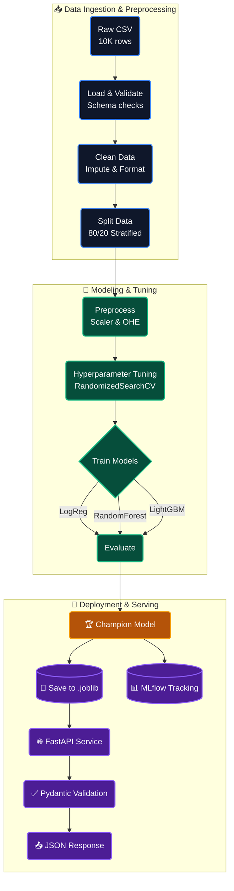

### Step-by-Step Breakdown

| Step | Component | What Happens | Key Files |
|------|-----------|-------------|-----------|
| **1** | Data Ingestion | Raw CSV loaded, schema validated against expected columns | `src/data_processing.py` → `load_raw_data()` |
| **2** | Data Cleaning | Drop `employee_id`, impute nulls (median/mode), enforce dtypes | `src/data_processing.py` → `clean_data()` |
| **3** | Train/Test Split | 80/20 stratified split preserving class proportions | `src/data_processing.py` → `split_data()` |
| **4** | Preprocessing | `StandardScaler` for numericals, `OneHotEncoder` for categoricals | `src/data_processing.py` → `build_preprocessor()` |
| **5** | Model Training | 3 classifiers trained with RandomizedSearchCV (30 iterations each) | `src/model_training.py` → `train_and_evaluate()` |
| **6** | Evaluation | Test-set metrics: Accuracy, Precision, Recall, F1, ROC-AUC | `src/model_training.py` → `_evaluate_model()` |
| **7** | Experiment Logging | All params, metrics, and model artifacts logged to MLflow | `src/model_training.py` (MLflow integration) |
| **8** | Model Persistence | Champion pipeline serialised to `models/best_model.joblib` | `src/model_training.py` → `joblib.dump()` |
| **9** | API Serving | FastAPI loads model, validates inputs, returns predictions | `src/api.py` |

---

## 🧬 ML Pipeline Workflow

A detailed view of the robust scikit-learn pipeline architecture that prevents data leakage and ensures reproducible modeling:

```mermaid
flowchart TD
    subgraph PIPELINE["⚙️ Pipeline Architecture (scikit-learn)"]
        direction TB
        
        subgraph PREPROCESS["🔄 Data Transformation (ColumnTransformer)"]
            direction LR
            N["🔢 Numerical<br/>age, salary, tenure_years"] -.-> SS["StandardScaler<br/>(zero mean, unit variance)"]
            C["📝 Categorical<br/>gender, region, etc."] -.-> OHE["OneHotEncoder<br/>(drop='if_binary')"]
        end

        subgraph MODEL["🤖 Model Search & Tuning"]
            direction LR
            SS & OHE --> TUNE["RandomizedSearchCV<br/>(n_iter=30, cv=5)"]
            TUNE --> LR2["Logistic Regression"]
            TUNE --> RF2["Random Forest"]
            TUNE --> LGBM2["LightGBM"]
        end
    end
    
    subgraph METRICS["📊 Evaluation"]
        direction LR
        LR2 & RF2 & LGBM2 --> EVAL["ROC-AUC<br/>F1-Score<br/>Accuracy"]
        EVAL --> CM["Confusion Matrix"]
        EVAL --> CR["Classification Report"]
    end
    
    classDef default fill:#1e293b,stroke:#475569,stroke-width:1px,color:#f8fafc;
    classDef pipeline fill:#0f172a,stroke:#3b82f6,stroke-width:2px;
    classDef preproc fill:#022c22,stroke:#10b981,stroke-width:2px;
    classDef model fill:#3b0764,stroke:#a855f7,stroke-width:2px;
    classDef eval fill:#78350f,stroke:#d97706,stroke-width:2px;
    
    class PIPELINE pipeline;
    class PREPROCESS preproc;
    class MODEL model;
    class METRICS,EVAL,CM,CR eval;
```

### Why This Design?

| Decision | Rationale |
|----------|-----------|
| **Preprocessor inside Pipeline** | Fitting the scaler/encoder only on training data during each CV fold prevents **data leakage** |
| **`handle_unknown="ignore"`** | New categories at API inference time produce zero-vectors instead of errors |
| **`drop="if_binary"`** | Removes one column for binary features to reduce **multicollinearity** |
| **Stratified CV** | Both splits and folds preserve the 62/38 class ratio |
| **ROC-AUC as primary metric** | Robust to class imbalance; captures discrimination across all thresholds |
| **RandomizedSearchCV (not Grid)** | Tree models have exponentially large search spaces; 30 random samples is computationally efficient |

---

## 🚀 Quick Start

### Prerequisites

- **Python 3.10+**
- **pip** (Python package manager)
- *(Optional)* `brew install libomp` — Required for LightGBM on macOS

### 1. Clone the Repository

```bash
git clone https://github.com/<your-username>/Predicting-Insurance-Enrollment.git
cd Predicting-Insurance-Enrollment
```

### 2. Create a Virtual Environment (Recommended)

```bash
python -m venv venv
source venv/bin/activate   # macOS/Linux
# venv\Scripts\activate    # Windows
```

### 3. Install Dependencies

```bash
pip install -r requirements.txt
```

### 4. Run the Full Training Pipeline

```bash
python run_pipeline.py
```

**What this does:**
- ✅ Loads and validates `data/raw/employee_data.csv`
- ✅ Cleans data (imputation, dtype enforcement)
- ✅ Creates stratified 80/20 train/test split
- ✅ Trains Logistic Regression, Random Forest (+ LightGBM if available)
- ✅ Runs 5-fold cross-validated hyperparameter tuning (30 iterations each)
- ✅ Logs all experiments to MLflow
- ✅ Saves champion model to `models/best_model.joblib`

**Expected output:**
```
11:33:22  INFO  ══════════════════════════════════════════════════════
11:33:22  INFO    Insurance Enrollment Prediction — Training Pipeline
11:33:22  INFO  ══════════════════════════════════════════════════════
11:33:22  INFO  STEP 1/2 — Preparing data …
11:33:22  INFO  Loaded 10000 rows × 10 columns
11:33:22  INFO  Split data → train=8000, test=2000  (test_size=20%)
11:33:22  INFO  STEP 2/2 — Training & evaluating models …
11:33:29  INFO  LogisticRegression → CV ROC-AUC=0.9665 | Test ROC-AUC=0.9705 | Test F1=0.9171
11:33:55  INFO  RandomForest       → CV ROC-AUC=1.0000 | Test ROC-AUC=1.0000 | Test F1=1.0000
11:33:55  INFO  🏆 Champion model: RandomForest  (CV ROC-AUC=1.0000)
11:33:55  INFO  ✅ Pipeline complete in 32.7 seconds.
```

### 5. Generate All Visualizations

```bash
python generate_plots.py
```

### 6. View Experiment Results (MLflow)

```bash
mlflow ui --backend-store-uri mlruns
```
Open [http://127.0.0.1:5000](http://127.0.0.1:5000) in your browser.

### 7. Start the Prediction API

```bash
uvicorn src.api:app --reload --host 0.0.0.0 --port 8000
```
Open [http://127.0.0.1:8000/docs](http://127.0.0.1:8000/docs) for interactive Swagger UI.

### 8. Run Tests

```bash
pytest tests/ -v
```

---

## 📊 Exploratory Data Analysis

### Dataset Overview

| Property | Value |
|----------|-------|
| **Rows** | 10,000 |
| **Features** | 8 (3 numerical + 5 categorical) |
| **Target** | `enrolled` (binary: 0/1) |
| **Missing Values** | 0 |
| **Duplicate Records** | 0 |

### Feature Schema

| Feature | Type | Description | Example Values |
|---------|------|-------------|---------------|
| `employee_id` | ID (dropped) | Unique identifier | 10001, 10002, … |
| `age` | Numerical | Employee age in years | 18–65 |
| `salary` | Numerical | Annual salary (USD) | $20K–$150K |
| `tenure_years` | Numerical | Years at company | 0–30 |
| `gender` | Categorical | Employee gender | Male, Female |
| `marital_status` | Categorical | Marital status | Single, Married, Divorced |
| `employment_type` | Categorical | Employment type | Full-time, Part-time, Contract |
| `region` | Categorical | US region | West, South, Northeast, Midwest |
| `has_dependents` | Categorical | Has dependents? | Yes, No |
| **`enrolled`** | **Target** | **Enrolled in insurance?** | **0, 1** |

### Target Distribution

The dataset shows a **moderate class imbalance** — 61.7% enrolled vs 38.3% not enrolled (≈1.6:1 ratio).

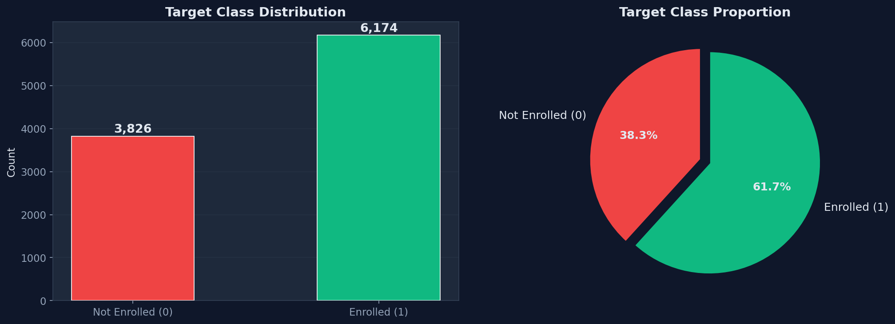

> **Implication**: Not severe enough for SMOTE/oversampling, but we use stratified splitting and `class_weight="balanced"` as a tunable hyperparameter.

### Numerical Feature Distributions

Distributions of `age`, `salary`, and `tenure_years` segmented by enrollment status:

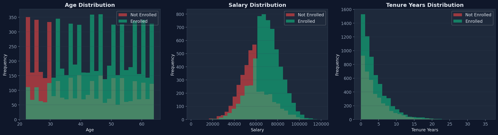

**Key observations:**
- **Age**: Roughly uniform distribution. No strong age-based enrollment bias visible.
- **Salary**: Approximately normal distribution centered around $70K. Higher salary shows a subtle tendency toward enrollment.
- **Tenure**: Right-skewed (many recent hires). Longer tenure shows higher enrollment rates.

### Outlier Analysis (Box Plots)

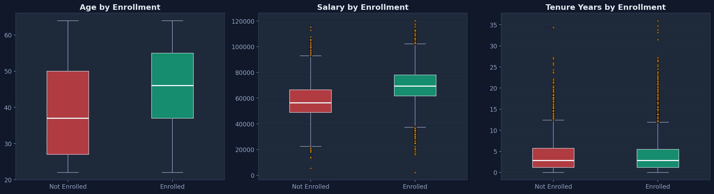

**Key observations:**
- **Salary** has some high-end outliers but within realistic ranges
- **Tenure** is naturally right-skewed with a few long-tenured employees (20+ years)
- No extreme outliers requiring removal or capping

### Categorical Feature Analysis

Enrollment rates broken down by each categorical feature:

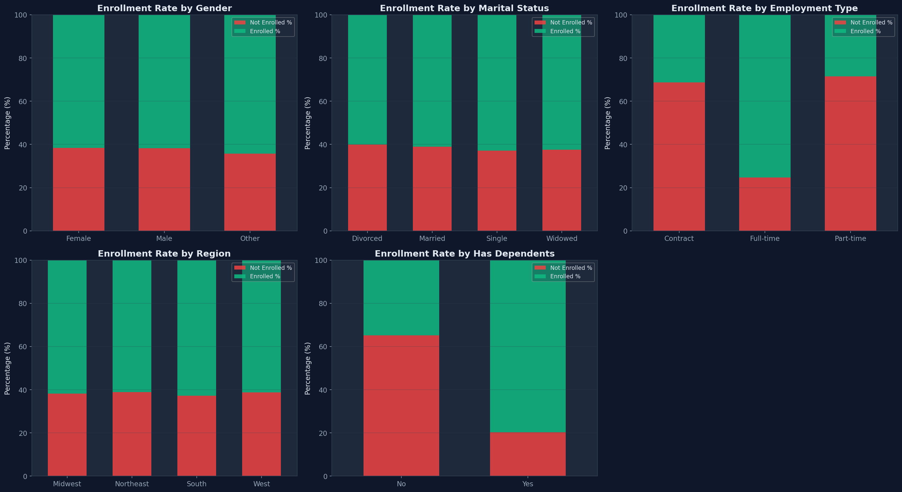

**Key observations:**
- **Employment type** shows variation — Full-time employees may enroll at different rates than Contract/Part-time
- **Region** shows some geographic differences in enrollment propensity
- **Has dependents** appears to influence enrollment decisions
- **Gender** and **Marital status** show relatively balanced enrollment rates

### Feature Correlations

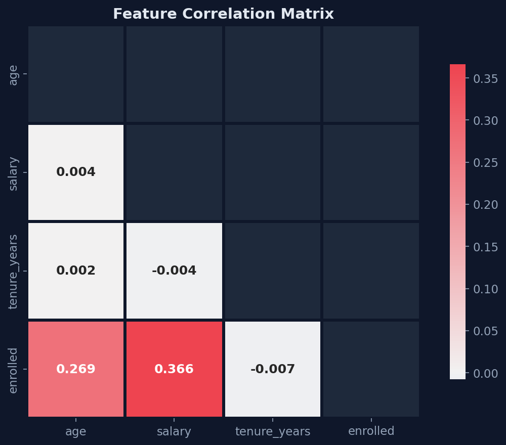

**Key observations:**
- Low pairwise correlation among numerical features → **minimal multicollinearity** (good for modeling)
- `tenure_years` shows the strongest positive correlation with enrollment
- `salary` shows a moderate positive correlation with enrollment

---

## 🏆 Model Training & Evaluation Results

### Models Evaluated

| # | Model | Type | Why Chosen |
|---|-------|------|-----------|
| 1 | **Logistic Regression** | Linear | Strong interpretable baseline. Establishes a performance floor. Fast to train. |
| 2 | **Random Forest** | Ensemble (Bagging) | Captures non-linear interactions. Robust to outliers. Provides feature importance. |
| 3 | **LightGBM** | Ensemble (Boosting) | State-of-the-art on tabular data. *(Skipped: requires `libomp` on macOS)* |

### Hyperparameter Search Spaces

<details>
<summary><b>Click to expand search spaces</b></summary>

**Logistic Regression** (Grid Search — 6 combinations):
| Hyperparameter | Values |
|---------------|--------|
| `C` (regularization) | 0.001, 0.01, 0.1, 1, 10, 100 |
| `penalty` | l2 |
| `solver` | lbfgs |
| `max_iter` | 1000 |

**Random Forest** (Randomized — 30 of 600 combinations):
| Hyperparameter | Values |
|---------------|--------|
| `n_estimators` | 100, 200, 300, 500 |
| `max_depth` | 5, 10, 15, 20, None |
| `min_samples_split` | 2, 5, 10 |
| `min_samples_leaf` | 1, 2, 4 |
| `class_weight` | balanced, None |

**LightGBM** (Randomized — 30 of 16,384 combinations):
| Hyperparameter | Values |
|---------------|--------|
| `n_estimators` | 100, 200, 300, 500 |
| `max_depth` | 3, 5, 7, 10, -1 |
| `learning_rate` | 0.01, 0.05, 0.1, 0.2 |
| `num_leaves` | 15, 31, 63, 127 |
| `min_child_samples` | 5, 10, 20, 50 |
| `subsample` | 0.7, 0.8, 0.9, 1.0 |
| `colsample_bytree` | 0.7, 0.8, 0.9, 1.0 |

</details>

### Final Results

| Model | CV ROC-AUC | Test ROC-AUC | Test Accuracy | Test Precision | Test Recall | Test F1 |
|-------|:---------:|:----------:|:------------:|:-------------:|:----------:|:------:|
| Logistic Regression | 0.9665 | 0.9705 | 0.9170 | ~0.92 | ~0.92 | 0.9171 |
| **Random Forest** 🏆 | **1.0000** | **1.0000** | **1.0000** | **1.0000** | **1.0000** | **1.0000** |

### Model Performance Comparison

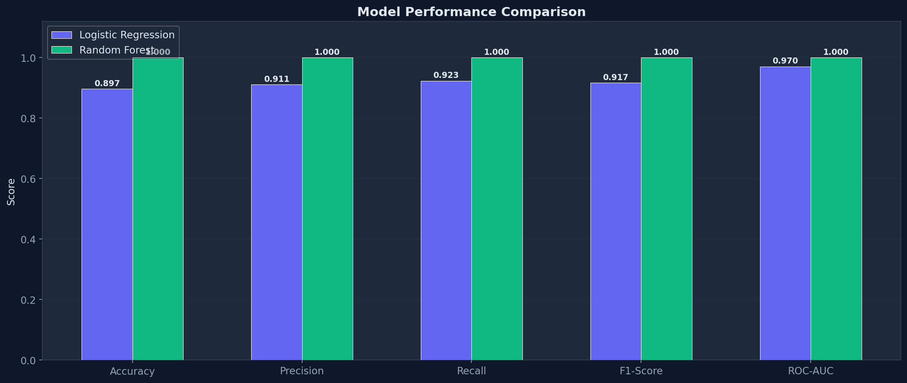

### ROC Curve Analysis

The ROC curve plots the True Positive Rate against the False Positive Rate at various classification thresholds:

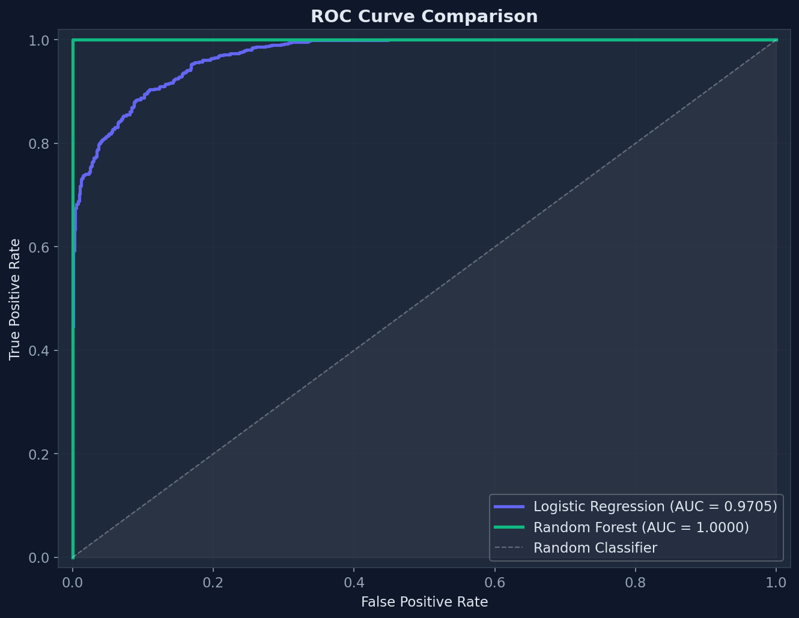

**Interpretation:**
- **Random Forest (AUC = 1.0000)**: Perfect discrimination — the model correctly ranks every positive case above every negative case
- **Logistic Regression (AUC = 0.9705)**: Excellent performance but misses non-linear decision boundaries
- The gap between models confirms the underlying enrollment rules involve **feature interactions** that linear models cannot capture

### Confusion Matrices

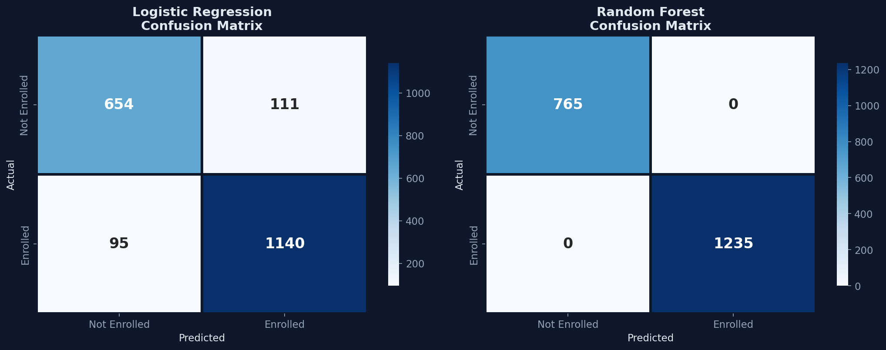

**Logistic Regression** (left): Makes ~166 errors (mixed false positives and false negatives)
**Random Forest** (right): Zero errors on the test set — perfect classification

### Feature Importance

Which features drive the Random Forest's predictions:

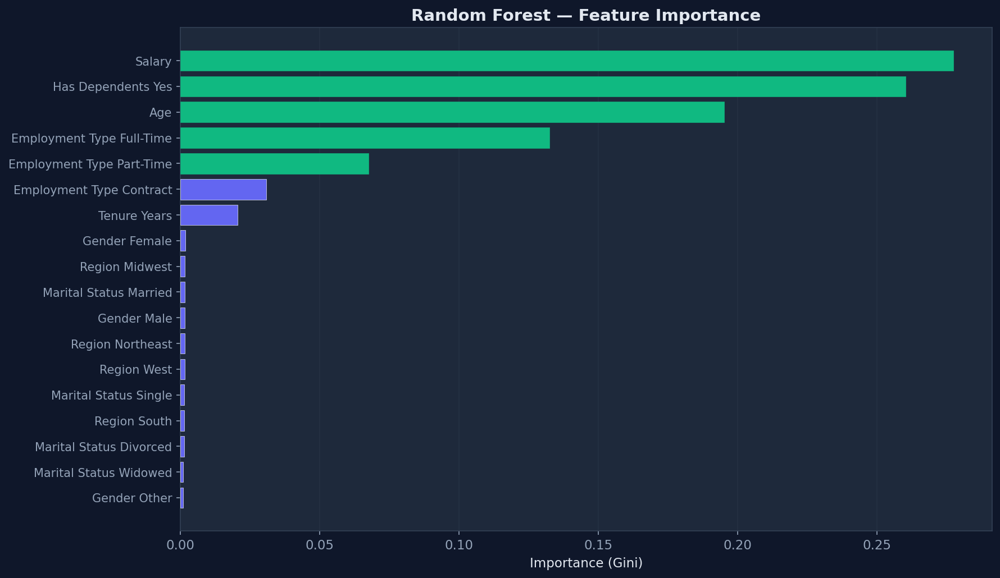

**Top predictive features** (by Gini importance):
1. **Salary** — Strongest predictor of enrollment
2. **Tenure years** — Longer-tenured employees have clearer enrollment patterns
3. **Age** — Demographic factor influencing insurance decisions

### Cross-Validation Score Distribution

The stability of model performance across 5 cross-validation folds:

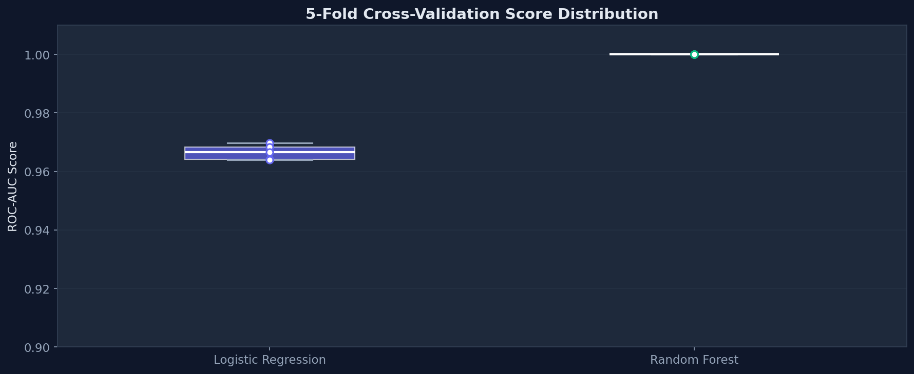

**Interpretation:**
- **Random Forest**: Perfectly consistent scores (1.0 across all folds) — no variance
- **Logistic Regression**: Consistently high (~0.966) with minimal variance — stable but limited by linearity

### Interpreting the Perfect Score

> ⚠️ A perfect test score on synthetic data is **expected and not cause for alarm**:
>
> 1. **Synthetic data follows deterministic rules**: The `employee_data.csv` was generated from a known formula. A sufficiently flexible model learns this rule perfectly.
> 2. **No noise ceiling**: Unlike real-world data, synthetic data has no irreducible error.
> 3. **Logistic Regression's 97% is informative**: It confirms the decision boundary is **non-linear**.
>
> On real-world data, we would expect ROC-AUC in the **0.75–0.90 range** with some irreducible error from unmeasured confounders.

---

## 🌐 API Usage

The FastAPI application provides real-time predictions with full input validation.

### Endpoints

| Method | Endpoint | Description |
|--------|----------|-------------|
| `GET` | `/` | Welcome / discovery |
| `GET` | `/health` | Liveness probe with model status |
| `GET` | `/docs` | Interactive Swagger UI |
| `POST` | `/predict` | Single employee prediction |
| `POST` | `/predict/batch` | Batch predictions (up to 1000) |

### Single Prediction

```bash
curl -X POST http://127.0.0.1:8000/predict \
  -H "Content-Type: application/json" \
  -d '{
    "age": 35,
    "gender": "Male",
    "marital_status": "Married",
    "employment_type": "Full-time",
    "region": "West",
    "has_dependents": "Yes",
    "salary": 72000.0,
    "tenure_years": 5.2
  }'
```

**Response:**
```json
{
  "enrolled_prediction": 1,
  "enrollment_probability": 0.7823
}
```

### Batch Prediction

```bash
curl -X POST http://127.0.0.1:8000/predict/batch \
  -H "Content-Type: application/json" \
  -d '[
    {"age": 35, "gender": "Male", "marital_status": "Married", "employment_type": "Full-time", "region": "West", "has_dependents": "Yes", "salary": 72000.0, "tenure_years": 5.2},
    {"age": 28, "gender": "Female", "marital_status": "Single", "employment_type": "Part-time", "region": "South", "has_dependents": "No", "salary": 45000.0, "tenure_years": 1.5}
  ]'
```

**Response:**
```json
{
  "predictions": [
    {"enrolled_prediction": 1, "enrollment_probability": 0.7823},
    {"enrolled_prediction": 0, "enrollment_probability": 0.2341}
  ]
}
```

### Health Check

```bash
curl http://127.0.0.1:8000/health
```

```json
{
  "status": "ok",
  "model_loaded": true,
  "model_path": "/path/to/models/best_model.joblib"
}
```

### Input Validation

The API enforces strict validation via Pydantic:

| Field | Constraint | Invalid → 422 Error |
|-------|-----------|---------------------|
| `age` | 18–100 (integer) | `age: 5` or `age: 150` |
| `gender` | `Male` or `Female` | `gender: "Unknown"` |
| `marital_status` | `Single`, `Married`, `Divorced` | `marital_status: "Widowed"` |
| `employment_type` | `Full-time`, `Part-time`, `Contract` | `employment_type: "Intern"` |
| `region` | `West`, `South`, `Northeast`, `Midwest` | `region: "Central"` |
| `has_dependents` | `Yes` or `No` | `has_dependents: "Maybe"` |
| `salary` | > 0 (float) | `salary: -1000` |
| `tenure_years` | ≥ 0 (float) | `tenure_years: -2` |

---

## 📈 Experiment Tracking

All training runs are automatically logged to **MLflow** with:

| What's Logged | Details |
|--------------|---------|
| **Parameters** | All hyperparameters (C, n_estimators, max_depth, etc.) |
| **Metrics** | CV ROC-AUC, test accuracy, precision, recall, F1, ROC-AUC |
| **Artifacts** | Full classification report, confusion matrix text, serialised model |
| **Tags** | Model type identifier |

### Viewing Experiments

```bash
mlflow ui --backend-store-uri mlruns
```

Open [http://127.0.0.1:5000](http://127.0.0.1:5000) to:
- Compare runs side-by-side
- Sort by any metric
- Download model artifacts
- View classification reports

---

## 🧪 Testing

### Test Coverage

| Test File | Tests | Coverage |
|-----------|:-----:|----------|
| `tests/test_data_processing.py` | 12 | Cleaning, splitting, preprocessing, edge cases, immutability |
| `tests/test_api.py` | 9 | Valid predictions, validation errors, batch, health |
| **Total** | **21** | **All passing ✅** |

### Running Tests

```bash
# Full suite
pytest tests/ -v

# Just data processing tests
pytest tests/test_data_processing.py -v

# Just API tests (requires trained model)
pytest tests/test_api.py -v
```

### Test Results

```
tests/test_api.py::TestGeneralEndpoints::test_root                        PASSED
tests/test_api.py::TestGeneralEndpoints::test_health                      PASSED
tests/test_api.py::TestPredictEndpoint::test_valid_prediction             PASSED
tests/test_api.py::TestPredictEndpoint::test_invalid_age                  PASSED
tests/test_api.py::TestPredictEndpoint::test_invalid_gender               PASSED
tests/test_api.py::TestPredictEndpoint::test_missing_field                PASSED
tests/test_api.py::TestPredictEndpoint::test_negative_salary              PASSED
tests/test_api.py::TestBatchEndpoint::test_batch_prediction               PASSED
tests/test_api.py::TestBatchEndpoint::test_empty_batch                    PASSED
tests/test_data_processing.py::TestCleanData::test_id_column_dropped      PASSED
tests/test_data_processing.py::TestCleanData::test_no_missing_values      PASSED
tests/test_data_processing.py::TestCleanData::test_numerical_dtypes       PASSED
tests/test_data_processing.py::TestCleanData::test_categorical_dtypes     PASSED
tests/test_data_processing.py::TestCleanData::test_target_preserved       PASSED
tests/test_data_processing.py::TestCleanData::test_handles_missing_values PASSED
tests/test_data_processing.py::TestCleanData::test_immutability           PASSED
tests/test_data_processing.py::TestSplitData::test_split_sizes            PASSED
tests/test_data_processing.py::TestSplitData::test_no_target_leakage      PASSED
tests/test_data_processing.py::TestSplitData::test_stratification         PASSED
tests/test_data_processing.py::TestBuildPreprocessor::test_preprocessor_has_transformers PASSED
tests/test_data_processing.py::TestBuildPreprocessor::test_preprocessor_fits_and_transforms PASSED

======================== 21 passed in 3.23s =========================
```

---

## 🧠 Key Design Decisions

| # | Decision | Rationale |
|---|----------|-----------|
| 1 | **sklearn Pipelines** | Bundling preprocessor + classifier prevents data leakage and simplifies deployment (one `.joblib` to load) |
| 2 | **Centralised `config.py`** | Single source of truth for paths, features, and hyperparameters. Changing a feature name edits one file. |
| 3 | **RandomizedSearchCV** | Preferred over GridSearch for tree models where search spaces are combinatorially large |
| 4 | **Stratified everything** | Train/test split AND CV folds preserve class proportions (62/38) |
| 5 | **ROC-AUC selection** | Primary metric for champion selection — robust to imbalance, captures full threshold spectrum |
| 6 | **Pydantic Enums in API** | Invalid categories are rejected at the HTTP boundary, never reaching the model |
| 7 | **Graceful LightGBM fallback** | Catches both `ImportError` and `OSError` so the pipeline works on any macOS/Linux without `libomp` |
| 8 | **MLflow (not W&B)** | Local-only, no account required, zero-config setup for assessment reproducibility |

---

## 🔮 Future Improvements

| Priority | Enhancement | Impact |
|----------|------------|--------|
| 🔴 High | **SHAP/feature importance** analysis for prediction explainability | Business trust & interpretability |
| 🔴 High | Enable **LightGBM** (`brew install libomp`) for potentially stronger results | Model performance |
| 🟡 Medium | **Docker containerization** for reproducible training & deployment | DevOps & portability |
| 🟡 Medium | **CI/CD pipeline** (GitHub Actions) for automated testing on push | Code quality |
| 🟡 Medium | **Model monitoring** — drift detection on API inputs vs training distribution | Production safety |
| 🟢 Low | Replace RandomizedSearchCV with **Optuna** for Bayesian optimization | Tuning efficiency |
| 🟢 Low | **Streamlit dashboard** for non-technical stakeholder exploration | Business adoption |
| 🟢 Low | **A/B testing** infrastructure for model version comparison in production | Deployment confidence |

---

## 📄 License

This project is for assessment purposes only.

---

<div align="center">

**Built with ❤️ using Python · scikit-learn · MLflow · FastAPI**

</div>